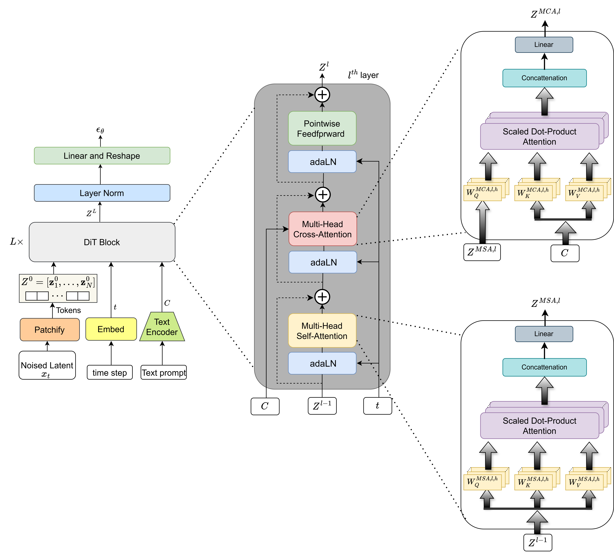
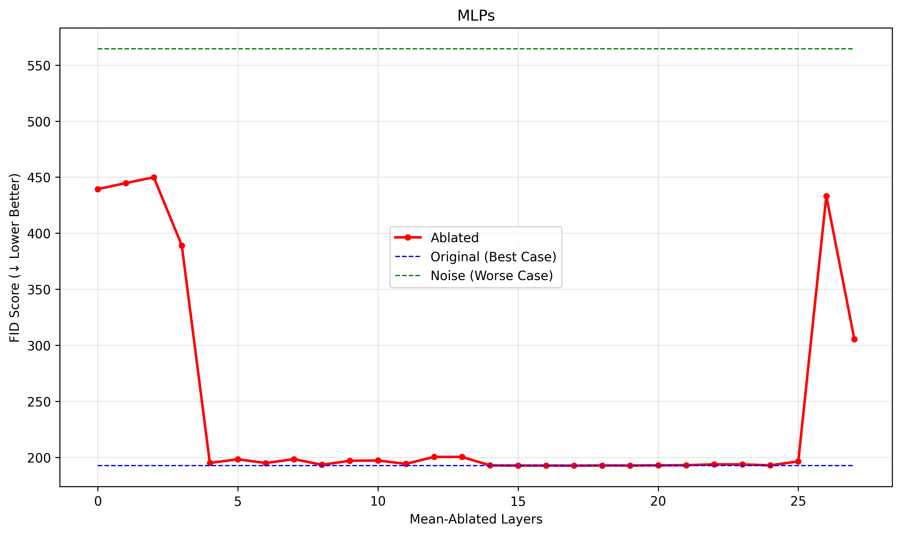
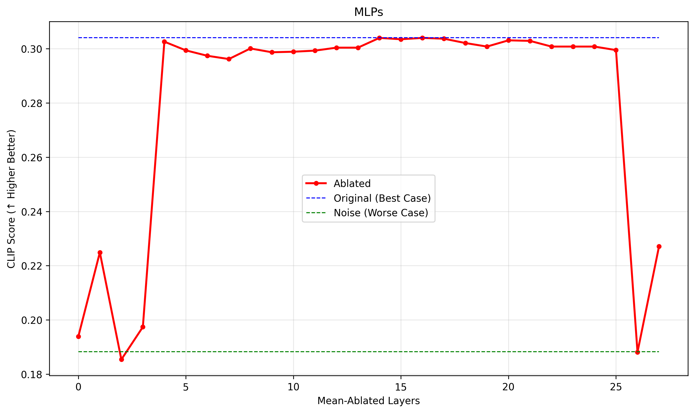
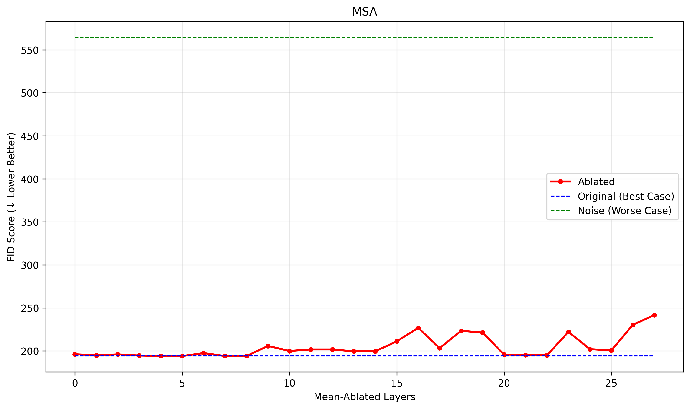
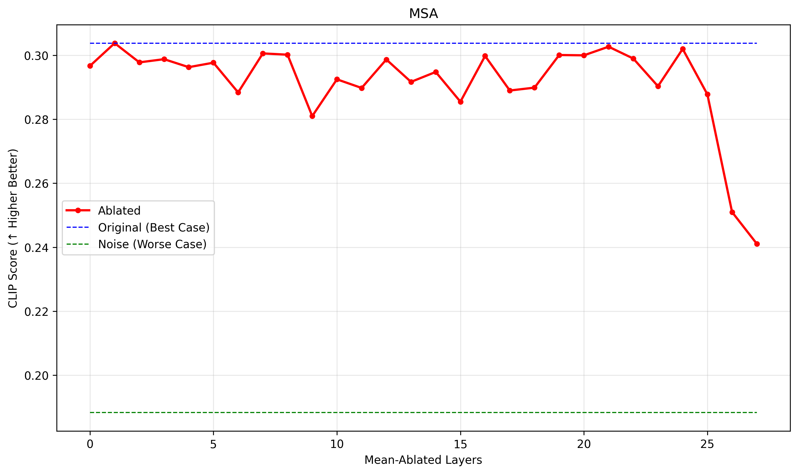
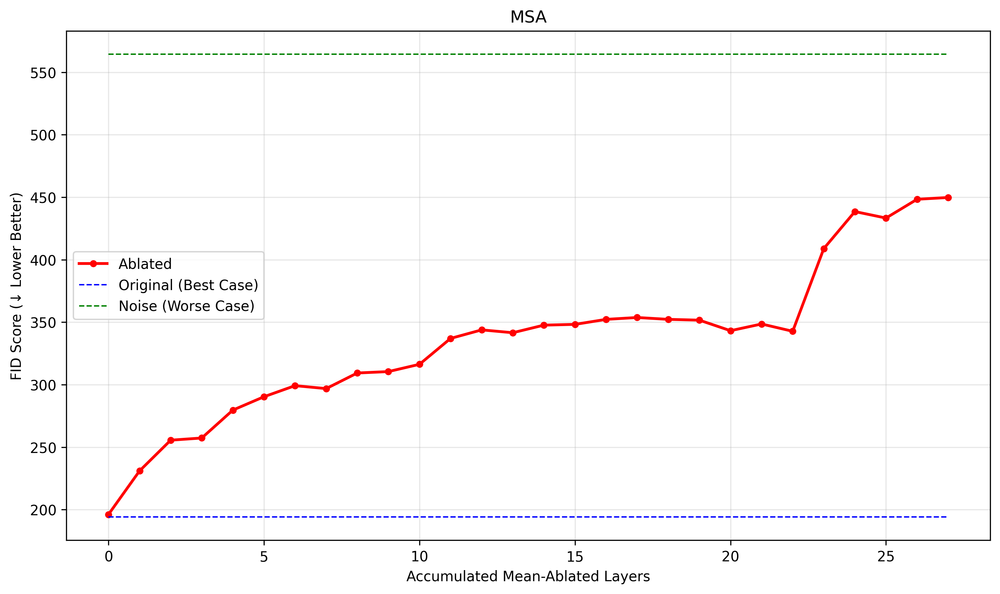
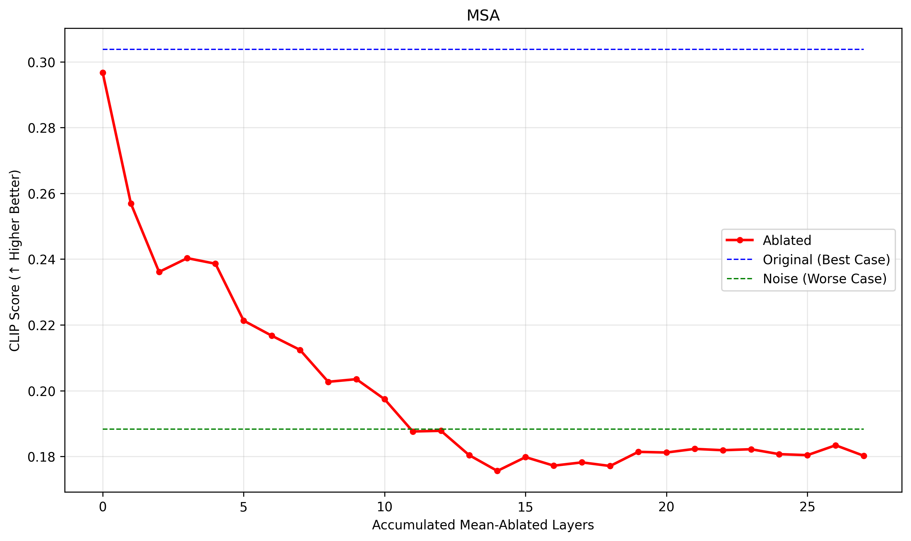

# Diffusion-Transformer-Ablations

**Diffusion-Transformer-Ablations** is a research toolkit for systematic ablation and interpretability analysis in diffusion models with DiT (Diffusion Transformer) backbones, such as PixArt-α.  
It enables researchers to selectively disable (ablate) self-attention, cross-attention, and MLP submodules in any DiT block during inference, and to quantify their importance via FID and CLIP metrics.

---
## 🧱 DiT Block Structure

The internal structure of each Diffusion Transformer (DiT) block is illustrated in the diagrams below.

As shown in the figure, each **DiT block** contains the following components:

- **Multi-Head Self-Attention (MSA)**
- **Multi-Head Cross-Attention (MCA)**
- **Pointwise Feedforward Network (MLP)**

  

*Figure 1: The architecture of the Diffusion Transformer (DiT) block.*

## Features

- **Ablate any block or submodule** (self-attention, cross-attention, MLP) in a DiT-based transformer.
- **Supports PixArt-α (Diffusers) out of the box.**
- **Batch generation** of images from COCO prompts.
- **Automated evaluation**: compute FID (with torch-fidelity) and CLIP similarity scores for generated images.

---

## Usage

1. **Prepare**:  
   - Download COCO val2017 images and captions.
   - Install dependencies: `diffusers`, `torch-fidelity`, `openai-clip`, `torch`, `PIL`, `tqdm`.

2. **Edit ablation settings** in the main script:  
   Choose which layers and which submodules (`attn1`, `attn2`, `ff`) to ablate, and set ablation mode (`zero`, `input`, or `mean`).

3. **Run** the script to:
   - Generate N images with and without ablation.
   - Compute FID and CLIP metrics for comparison.

---

# 🔍 Component Importance Analysis

This section analyzes the importance of each transformer component using **mean ablation**. We evaluate the effect of ablating each layer on **CLIP similarity** and **FID score**, using 1,000 images randomly sampled from the **COCO-30k** dataset.

---

## 🧠 MLP (Feedforward) Layers

Ablation results for the MLP layers reveal a consistent **U-shaped importance pattern**:

- **Early layers (0–4):** Removing any of these causes **catastrophic degradation**. FID increases from ~195 to **440–450**, and CLIP similarity drops sharply. These layers are critical for capturing **basic semantic and structural information**.
- **Middle layers (5–24):** These layers show **strong redundancy**. Ablating them leads to **minimal impact**, suggesting their outputs can be compensated for by the rest of the network.
- **Final layers (25–27):** Removing these layers again causes **severe quality loss**, indicating their role in **refinement and image detail generation**.

### 🔹 FID Degradation for MLP Layers

  

*Figure 1: FID scores after individual MLP layer ablation. Early and late layers are essential.*

### 🔹 CLIP Similarity for MLP Layers

  

*Figure 2: CLIP similarity drops significantly when early or final MLP layers are ablated.*

---

## 🧭 MSA (Multi-Head Self-Attention) Layers

Ablation of MSA layers shows similar patterns:

- **Early & late layers:** Highly sensitive. Removing these layers significantly **degrades generation quality**, confirming their importance for **semantic coherence** and **long-range context modeling**.
- **Middle layers:** These show **relatively minimal effect** when ablated, implying some **redundancy**.

### 🔹 FID Degradation for MSA Layers

  

*Figure 3: FID increases dramatically when early or final MSA layers are ablated.*

### 🔹 CLIP Similarity for MSA Layers

  

*Figure 4: CLIP similarity is most affected by early and late MSA layer ablation.*

---

## 📈 Cumulative Ablation of MSA Layers

We also evaluate **cumulative ablation**, where multiple MSA layers are sequentially replaced by mean activations.

- **Early-phase removal:** FID increases rapidly, reaching ~300 after a few layers.
- **Mid-phase plateau:** Once early crucial layers are removed, additional ablations have limited further effect.
- **Late-phase spike:** Removing final attention layers again worsens performance, approaching **worst-case degradation**.

### 🔹 FID Curve for Cumulative MSA Ablation

  

*Figure 5: FID increases monotonically as more MSA layers are removed.*

### 🔹 CLIP Similarity Curve for Cumulative MSA Ablation

  

*Figure 6: CLIP similarity gradually drops with cumulative MSA layer removal.*

---

## ✅ Summary

- Both **MLP** and **MSA** layers show **non-uniform importance**.
- **Early and late layers** in both components are **critical** for performance.
- **Middle layers** tend to be **redundant**, offering opportunities for **model simplification** or **pruning** without significant performance drop.

This analysis informs both **model interpretability** and **optimization** strategies for efficient deployment.

